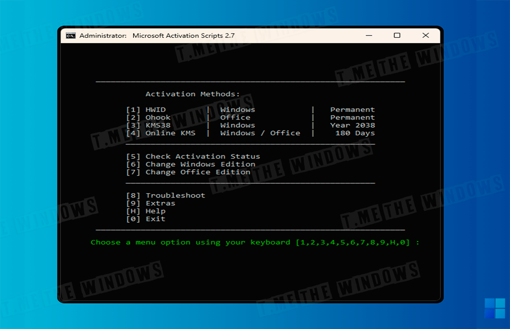
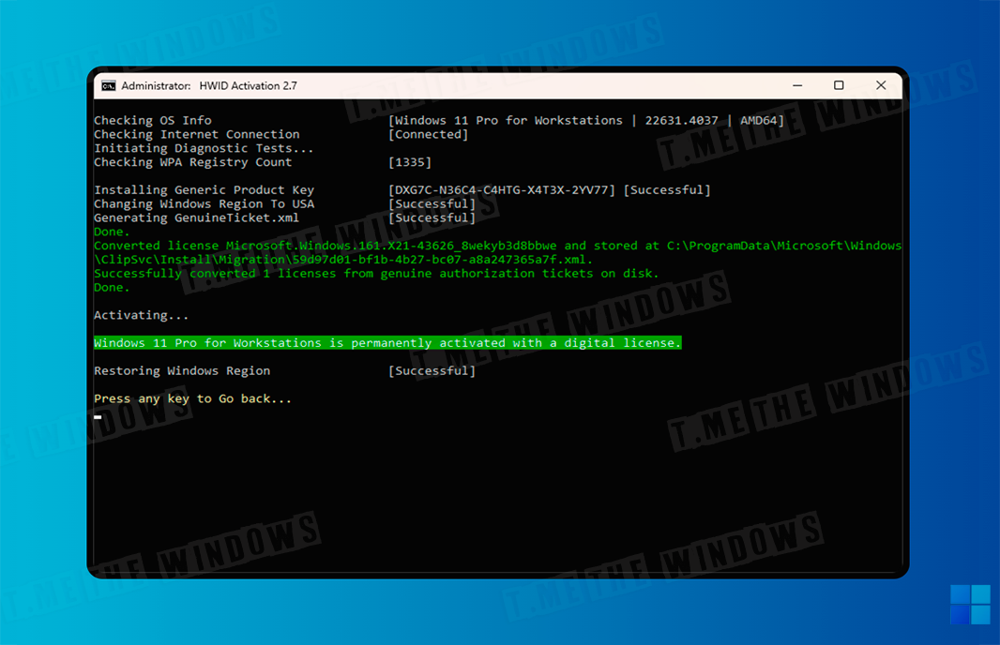
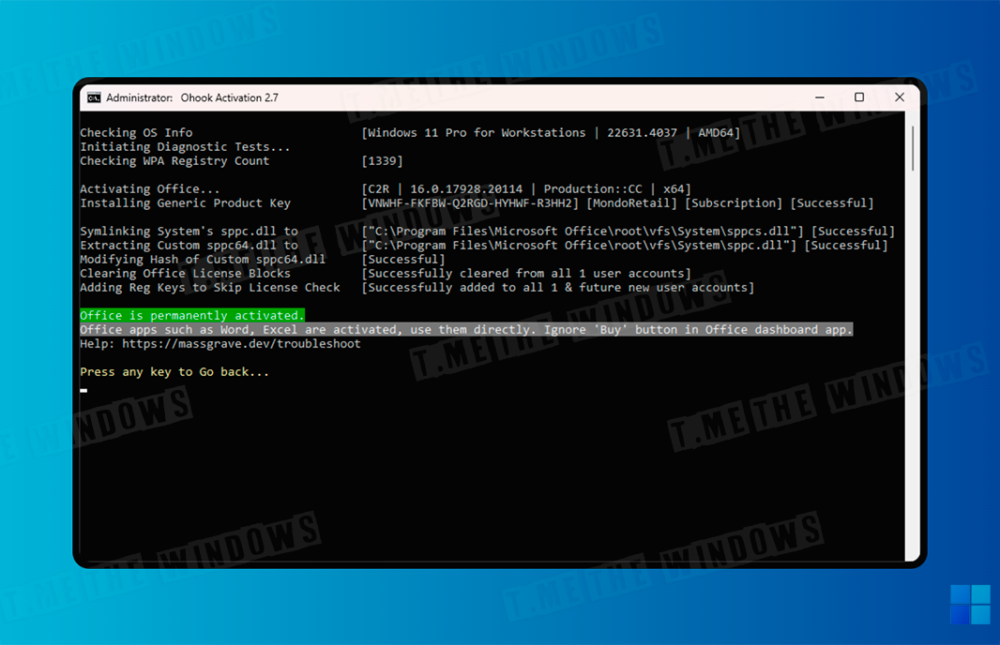
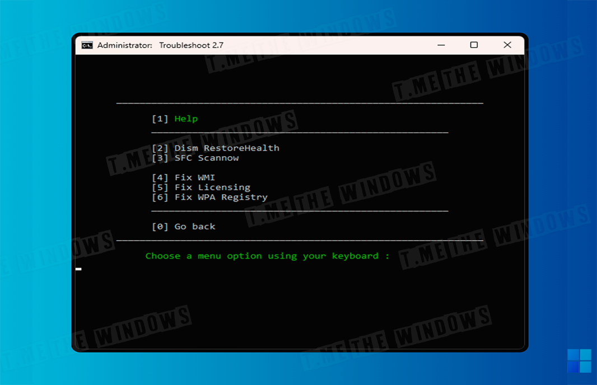
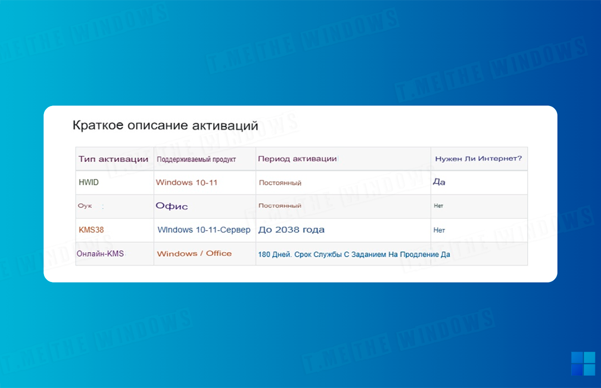

# Microsoft Activation Scripts (MAS)

Активатор Windows и Office с открытым исходным кодом, включающий методы активации HWID, Ohook, KMS38 и Online KMS, а также расширенные возможности устранения неполадок.

**Метод 1:** Активация через PowerShell (Windows 8 и более поздние версии)

1. **Откройте PowerShell:**

    Щелкните правой кнопкой мыши на кнопке Пуск в Windows.

	 Выберите PowerShell или Терминал (в зависимости от версии вашей ОС).

2. **Вставьте код:** 

```
	irm https://get.activated.win | iex
```

Скопируйте следующий код и вставьте его в PowerShell, затем нажмите Enter.

3. **Выберите вариант активации:**

	После выполнения кода вам будут предложены два варианта:

		[1] HWID — для активации Windows.
		[2] Ohook — для активации Office. 

**Готово:**

 После выбора нужного варианта активация будет завершена.



**Примечание:**

Команда IRM в PowerShell загружает сценарий с указанного URL-адреса.

Команда IEX выполняет загруженный сценарий.

## Рекомендации по безопасности:

1. **Перепроверяйте URL-адрес:**

	Перед выполнением команды обязательно убедитесь, что указанный URL надежен.

2. **Проверяйте источник:**

	Если вы вручную загружаете файлы, всегда проверяйте их источник на подлинность.

3. **Осторожность с вредоносными программами:**

	Будьте внимательны! Некоторые злоумышленники распространяют вредоносные программы, маскируя их под **MAS** и предоставляя подозрительные URL-адреса для загрузки через IRM.

Последняя версия MAS

Последняя версия - v2.8 (9-Nov-2024)

[GitHub](https://github.com/massgravel/Microsoft-Activation-Scripts).


## Особенности:

**HWID (цифровая лицензия):** обеспечивает постоянную активацию Windows.



**Ohook:** используется для постоянной активации Office.



**KMS38:** активирует Windows/Server до 2038 года.

**Онлайн-метод KMS:** активация Windows/Server/Office на 180 дней с возможностью пожизненного продления через задачу автопродления.

## Дополнительные возможности:

Устранение неполадок при активации.



Использование папок $OEM$ для автоматической предварительной активации.

Возможность изменения редакции Windows и Office.

Проверка текущего состояния активации для Windows и Office.

## Форматы и доступность:

Доступны версии **«Все в одном»** и **«Отдельные файлы»**.

Полностью на основе открытого исходного кода и пакетных скриптов.

Оптимизировано для снижения ложных срабатываний антивирусов.

